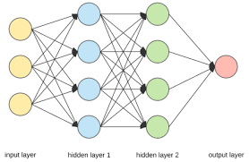
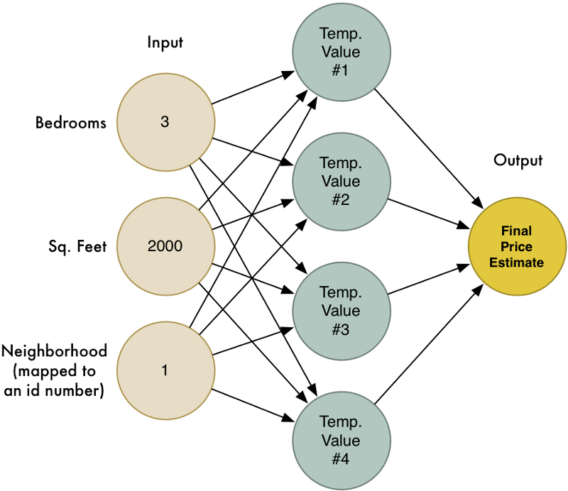
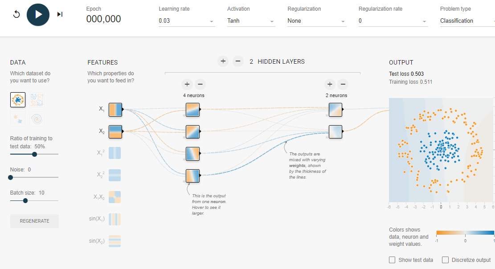
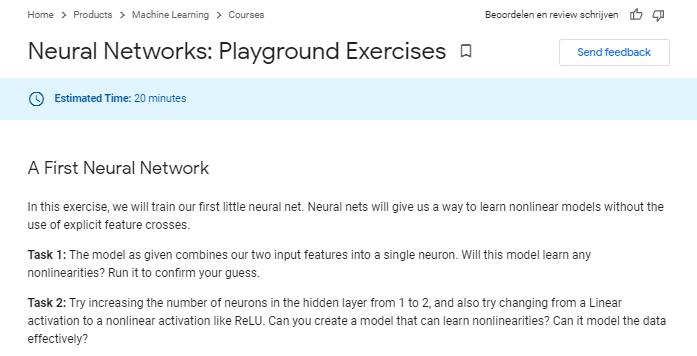

```{r setup, include=FALSE}
knitr::opts_chunk$set(echo = FALSE)
```

## Neural Networks

Prediction model (regression or classification)

- made up of hidden layers with neurons

- behavior of neurons is characterized by an activation function

- "firing rate" of the neurons determined by regression weights


<br>

Training 

1. random configuration of regression weights

2. feedback on model performance to adjust the weights (back-propagation)

3. repeat 2 (epoch) until convergence

4. estimation involves train/dev/test and regularization (L1, L2)
 

## Schematically

A neural network with two hidden layers

<br>

<center>
{width=400px}

</center>


## Example house prices 

A neural network with hidden layer to predict price (hence regression)

<center>

{width=500px}

</center>

## Examples of activation functions

- Relu: either 0 or linear

- Sigmoid: between 0 and 1 (probabilities)

<br>

<center>
{width=500px}
</center>
![]


## Recent achievements

Alpha-Zero

- learned itself to play chess (no access to chess theory)

- after only 4 hours of practice, it defeated Stockfish (traditional chess machine)


{width=600px}

## Play around

<https://playground.tensorflow.org/>


<br>

{width=800px}


## Do some exercises 

Do the [Playground Exercises](https://developers.google.com/machine-learning/crash-course/introduction-to-neural-networks/playground-exercises) to gain some insight on how networks work.

If you find a satisfactory solution to the Spiral exercise, please present!

<br>




